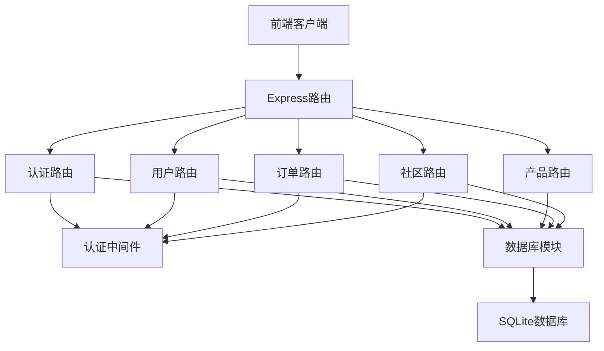
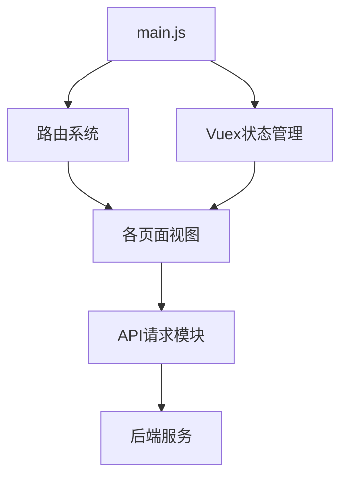

# 芒盒平台关键技术文档

## 1. 项目技术栈

### 1.1 后端技术栈

| 技术/框架 | 版本 | 用途 |
|---------|------|------|
| Node.js | - | 运行环境 |
| Express | ^4.18.2 | Web服务器框架 |
| SQLite3 | ^5.1.7 | 数据库 |
| JSON Web Token | ^9.0.2 | 用户认证 |
| bcryptjs | ^2.4.3 | 密码加密 |
| CORS | ^2.8.5 | 跨域资源共享 |
| dotenv | ^16.0.3 | 环境变量管理 |
| multer | ^1.4.5-lts.1 | 文件上传 |

### 1.2 前端技术栈

| 技术/框架 | 版本 | 用途 |
|---------|------|------|
| Vue.js | ^3.4.0 | 前端框架 |
| Vue Router | ^4.2.5 | 路由管理 |
| Vuex | ^4.1.0 | 状态管理 |
| Bootstrap | ^5.3.3 | UI组件库 |
| Axios | ^1.6.0 | HTTP客户端 |
| Vite | ^5.0.0 | 构建工具 |
| animate.css | ^4.1.1 | 动画效果 |

## 2. 功能模块划分

### 2.1 后端模块

#### 2.1.1 认证模块 (Auth)
**职责**：用户注册、登录、验证码发送与验证、Token管理
**文件位置**：`backend/routes/auth.js`
**主要功能**：
- 用户注册与登录认证
- 手机验证码发送与验证
- JWT令牌生成与验证
- 权限中间件实现

#### 2.1.2 用户模块 (Users)
**职责**：用户信息管理、个人资料维护、用户关系管理
**文件位置**：`backend/routes/users.js`
**主要功能**：
- 用户信息查询与更新
- 用户头像上传
- 关注/粉丝关系管理
- 用户积分与等级管理

#### 2.1.3 产品模块 (Products)
**职责**：盲盒产品信息管理、库存控制、产品分类
**文件位置**：`backend/routes/products.js`
**主要功能**：
- 产品列表与详情查询
- 产品分类与筛选
- 库存管理与更新
- 产品评价与评分

#### 2.1.4 订单模块 (Orders)
**职责**：订单创建、支付、状态管理
**文件位置**：`backend/routes/orders.js`
**主要功能**：
- 订单创建与管理
- 订单状态更新（支付、发货、收货、取消）
- 订单查询与统计

#### 2.1.5 社区模块 (Community)
**职责**：用户社区内容管理、互动功能
**文件位置**：`backend/routes/community.js`
**主要功能**：
- 社区帖子发布与管理
- 点赞、评论互动功能

#### 2.1.6 数据库模块
**职责**：数据库连接管理、SQL执行、数据模型操作
**文件位置**：`backend/utils/database.js`
**主要功能**：
- SQLite数据库连接与初始化
- 数据库健康检查
- 统一的SQL执行接口
- 表结构自动创建与维护

### 2.2 前端模块

#### 2.2.1 认证模块
**职责**：用户登录、注册界面与交互
**文件位置**：`frontend/src/views/auth/`
**主要组件**：
- Login.vue：登录页面
- Register.vue：注册页面

#### 2.2.2 商城模块
**职责**：商品展示、搜索、详情查看
**文件位置**：`frontend/src/views/shop/`
**主要组件**：
- Shop.vue：商品列表页面
- ProductDetail.vue：商品详情页面
- Cart.vue：购物车页面

#### 2.2.3 用户中心
**职责**：用户个人信息管理、订单管理
**文件位置**：`frontend/src/views/user/`
**主要组件**：
- Profile.vue：个人主页
- Orders.vue：订单列表
- Settings.vue：设置页面
- EditProfile.vue：编辑个人信息

#### 2.2.4 收藏模块
**职责**：用户收藏管理
**文件位置**：`frontend/src/views/collection/`
**主要组件**：
- Collection.vue：我的收藏页面

#### 2.2.5 社区模块
**职责**：社区互动内容展示
**文件位置**：`frontend/src/views/community/`
**主要组件**：
- Community.vue：社区主页

#### 2.2.6 开箱模块
**职责**：盲盒开箱体验
**文件位置**：`frontend/src/views/open/`
**主要组件**：
- OpenBox.vue：开箱页面

#### 2.2.7 客户服务模块
**职责**：提供用户帮助与支持信息
**文件位置**：`frontend/src/views/customer-service/`
**主要组件**：
- HelpCenter.vue：帮助中心
- Contact.vue：联系我们
- ReturnPolicy.vue：退货政策
- ShippingInfo.vue：配送信息

#### 2.2.8 法律信息模块
**职责**：展示法律相关信息
**文件位置**：`frontend/src/views/legal/`
**主要组件**：
- PrivacyPolicy.vue：隐私政策
- TermsOfService.vue：服务条款
- LegalNotice.vue：法律声明

## 3. 模块交互关系

### 3.1 后端模块交互



### 3.2 前端模块交互



## 4. 数据库设计

### 4.1 核心表结构

#### 4.1.1 users表

| 字段名 | 数据类型 | 约束 | 描述 |
|-------|---------|------|------|
| id | INTEGER | PRIMARY KEY AUTOINCREMENT | 用户唯一标识符 |
| username | TEXT | NOT NULL UNIQUE | 用户名，系统内唯一 |
| email | TEXT | UNIQUE | 电子邮箱，可选但唯一 |
| password | TEXT | NOT NULL | 经过bcrypt加密的用户密码 |
| avatar | TEXT | DEFAULT '' | 用户头像图片URL |
| points | INTEGER | DEFAULT 0 | 用户积分，用于等级计算和兑换 |
| level | TEXT | DEFAULT '普通会员' | 用户等级，根据积分自动升级 |
| followers | INTEGER | DEFAULT 0 | 用户粉丝数量 |
| following | INTEGER | DEFAULT 0 | 用户关注的人数 |
| posts | INTEGER | DEFAULT 0 | 用户发布的帖子数量 |
| created_at | TEXT | DEFAULT CURRENT_TIMESTAMP | 用户注册时间 |
| updated_at | TEXT | DEFAULT CURRENT_TIMESTAMP | 用户信息最后更新时间 |

#### 4.1.2 products表

| 字段名 | 数据类型 | 约束 | 描述 |
|-------|---------|------|------|
| id | INTEGER | PRIMARY KEY AUTOINCREMENT | 产品唯一标识符 |
| name | TEXT | NOT NULL | 产品名称 |
| description | TEXT | DEFAULT '' | 产品详细描述 |
| price | REAL | NOT NULL DEFAULT 0 | 产品当前售价 |
| original_price | REAL | DEFAULT 0 | 产品原价，用于显示折扣 |
| category | TEXT | DEFAULT '' | 产品分类，如"手办"、"模型"等 |
| series | TEXT | DEFAULT '' | 产品所属系列 |
| brand | TEXT | DEFAULT '' | 产品品牌 |
| stock | INTEGER | DEFAULT 0 | 产品库存量 |
| sales | INTEGER | DEFAULT 0 | 产品销售量 |
| rating | REAL | DEFAULT 0 | 产品平均评分 |
| review_count | INTEGER | DEFAULT 0 | 产品评价数量 |
| images | TEXT | DEFAULT '[]' | 产品图片URL数组，JSON格式存储 |
| is_hot | INTEGER | DEFAULT 0 | 是否热门商品(0/1) |
| is_new | INTEGER | DEFAULT 0 | 是否新品(0/1) |
| is_limited | INTEGER | DEFAULT 0 | 是否限量版(0/1) |
| probability | TEXT | DEFAULT '{}' | 盲盒概率配置，JSON格式存储各款式抽中概率 |
| created_at | TEXT | DEFAULT CURRENT_TIMESTAMP | 产品创建时间 |
| updated_at | TEXT | DEFAULT CURRENT_TIMESTAMP | 产品信息最后更新时间 |

#### 4.1.3 orders表

| 字段名 | 数据类型 | 约束 | 描述 |
|-------|---------|------|------|
| id | INTEGER | PRIMARY KEY AUTOINCREMENT | 订单唯一标识符 |
| user_id | INTEGER | NOT NULL | 下单用户ID，外键关联users表 |
| items | TEXT | NOT NULL | 订单商品信息，JSON格式存储 |
| total_amount | REAL | NOT NULL | 订单总金额 |
| status | TEXT | DEFAULT 'pending' | 订单状态(pending/paid/shipped/delivered/cancelled) |
| payment_method | TEXT | DEFAULT '' | 支付方式 |
| payment_id | TEXT | DEFAULT '' | 支付系统订单ID |
| shipping_address | TEXT | DEFAULT '{}' | 配送地址信息，JSON格式存储 |
| tracking_number | TEXT | DEFAULT '' | 物流单号 |
| created_at | TEXT | DEFAULT CURRENT_TIMESTAMP | 订单创建时间 |
| updated_at | TEXT | DEFAULT CURRENT_TIMESTAMP | 订单最后更新时间 |
| paid_at | TEXT | NULL | 支付完成时间 |
| shipped_at | TEXT | NULL | 发货时间 |
| delivered_at | TEXT | NULL | 送达时间 |
| cancelled_at | TEXT | NULL | 取消时间 |
| cancellation_reason | TEXT | DEFAULT '' | 取消原因 |

#### 4.1.4 posts表（社区帖子）

| 字段名 | 数据类型 | 约束 | 描述 |
|-------|---------|------|------|
| id | INTEGER | PRIMARY KEY AUTOINCREMENT | 帖子唯一标识符 |
| user_id | INTEGER | NOT NULL | 发帖用户ID，外键关联users表 |
| title | TEXT | NOT NULL | 帖子标题 |
| content | TEXT | NOT NULL | 帖子内容 |
| images | TEXT | DEFAULT '[]' | 帖子图片，JSON格式存储 |
| likes | INTEGER | DEFAULT 0 | 点赞数 |
| comments | INTEGER | DEFAULT 0 | 评论数 |
| created_at | TEXT | DEFAULT CURRENT_TIMESTAMP | 发帖时间 |
| updated_at | TEXT | DEFAULT CURRENT_TIMESTAMP | 最后更新时间 |

#### 4.1.5 favorites表（用户收藏）

| 字段名 | 数据类型 | 约束 | 描述 |
|-------|---------|------|------|
| id | INTEGER | PRIMARY KEY AUTOINCREMENT | 收藏记录ID |
| user_id | INTEGER | NOT NULL | 用户ID，外键关联users表 |
| product_id | INTEGER | NOT NULL | 产品ID，外键关联products表 |
| created_at | TEXT | DEFAULT CURRENT_TIMESTAMP | 收藏时间 |

### 4.2 关系图

```mermaid
erd
    users {
        int id PK
        varchar username
        varchar email
        varchar password
        varchar avatar
        int points
        varchar level
        int followers
        int following
        int posts
        datetime created_at
        datetime updated_at
    }
    
    products {
        int id PK
        varchar name
        text description
        decimal price
        decimal original_price
        varchar category
        varchar series
        varchar brand
        int stock
        int sales
        decimal rating
        int review_count
        text images
        int is_hot
        int is_new
        int is_limited
        text probability
        datetime created_at
        datetime updated_at
    }
    
    orders {
        int id PK
        int user_id FK
        text items
        decimal total_amount
        varchar status
        varchar payment_method
        varchar payment_id
        text shipping_address
        varchar tracking_number
        datetime created_at
        datetime updated_at
        datetime paid_at
        datetime shipped_at
        datetime delivered_at
        datetime cancelled_at
        varchar cancellation_reason
    }
    
    posts {
        int id PK
        int user_id FK
        varchar title
        text content
        text images
        int likes
        int comments
        datetime created_at
        datetime updated_at
    }
    
    favorites {
        int id PK
        int user_id FK
        int product_id FK
        datetime created_at
    }
    
    users ||--o{ orders : places
    users ||--o{ posts : creates
    users ||--o{ favorites : collects
    products ||--o{ favorites : is_collected_in
```

## 5. 核心代码实现

### 5.1 后端核心实现

#### 5.1.1 数据库连接与初始化

```javascript
/**
 * 数据库连接管理与初始化
 * 负责建立SQLite连接、创建表结构、提供统一的查询接口
 */
const sqlite3 = require('sqlite3').verbose();
const path = require('path');
const logger = require('./logger');
const fs = require('fs').promises;

// 数据库连接配置
const DB_CONFIG = {
    DB_PATH: path.join(__dirname, '..', 'data', 'manghe.db'),
    MAX_CONNECTIONS: 10,
    CONNECTION_TIMEOUT: 5000
};

let db = null;

// 确保数据目录存在
async function ensureDataDirectoryExists() {
    const dataDir = path.dirname(DB_CONFIG.DB_PATH);
    try {
        await fs.mkdir(dataDir, { recursive: true });
        logger.info(`数据目录 ${dataDir} 已确保存在`);
    } catch (error) {
        logger.error('创建数据目录失败:', error);
        throw error;
    }
}

// 初始化SQLite连接
async function initializeSQLite() {
    return new Promise((resolve, reject) => {
        db = new sqlite3.Database(DB_CONFIG.DB_PATH, sqlite3.OPEN_READWRITE | sqlite3.OPEN_CREATE, (err) => {
            if (err) {
                logger.error('SQLite连接失败:', err);
                reject(err);
                return;
            }
            logger.info('SQLite数据库连接成功');
            resolve();
        });

        // 设置数据库超时
        db.configure('busyTimeout', DB_CONFIG.CONNECTION_TIMEOUT);
    });
}

// 测试数据库连接
async function testDatabaseConnection() {
    return new Promise((resolve, reject) => {
        db.get('SELECT sqlite_version() AS version', (err, row) => {
            if (err) {
                logger.error('数据库连接测试失败:', err);
                reject(err);
                return;
            }
            logger.info(`SQLite版本: ${row.version}`);
            resolve();
        });
    });
}

// 初始化数据库
async function initializeDatabase() {
    try {
        // 确保数据目录存在
        await ensureDataDirectoryExists();
        
        // 初始化SQLite连接
        await initializeSQLite();
        
        // 测试数据库连接
        await testDatabaseConnection();
        
        // 创建表结构
        await createTables();
        
        logger.info('数据库初始化完成');
        return true;
    } catch (error) {
        logger.error('数据库初始化失败:', error);
        return false;
    }
}

// 创建表结构
async function createTables() {
    // 创建用户表
    const createUsersTable = `
    CREATE TABLE IF NOT EXISTS users (
        id INTEGER PRIMARY KEY AUTOINCREMENT,
        username TEXT NOT NULL UNIQUE,
        email TEXT UNIQUE,
        password TEXT NOT NULL,
        avatar TEXT DEFAULT '',
        points INTEGER DEFAULT 0,
        level TEXT DEFAULT '普通会员',
        followers INTEGER DEFAULT 0,
        following INTEGER DEFAULT 0,
        posts INTEGER DEFAULT 0,
        created_at TEXT DEFAULT CURRENT_TIMESTAMP,
        updated_at TEXT DEFAULT CURRENT_TIMESTAMP
    );
    `;
    
    // 创建产品表
    const createProductsTable = `
    CREATE TABLE IF NOT EXISTS products (
        id INTEGER PRIMARY KEY AUTOINCREMENT,
        name TEXT NOT NULL,
        description TEXT DEFAULT '',
        price REAL NOT NULL DEFAULT 0,
        original_price REAL DEFAULT 0,
        category TEXT DEFAULT '',
        series TEXT DEFAULT '',
        brand TEXT DEFAULT '',
        stock INTEGER DEFAULT 0,
        sales INTEGER DEFAULT 0,
        rating REAL DEFAULT 0,
        review_count INTEGER DEFAULT 0,
        images TEXT DEFAULT '[]',
        is_hot INTEGER DEFAULT 0,
        is_new INTEGER DEFAULT 0,
        is_limited INTEGER DEFAULT 0,
        probability TEXT DEFAULT '{}',
        created_at TEXT DEFAULT CURRENT_TIMESTAMP,
        updated_at TEXT DEFAULT CURRENT_TIMESTAMP
    );
    `;
    
    // 创建订单表
    const createOrdersTable = `
    CREATE TABLE IF NOT EXISTS orders (
        id INTEGER PRIMARY KEY AUTOINCREMENT,
        user_id INTEGER NOT NULL,
        items TEXT NOT NULL,
        total_amount REAL NOT NULL,
        status TEXT DEFAULT 'pending',
        payment_method TEXT DEFAULT '',
        payment_id TEXT DEFAULT '',
        shipping_address TEXT DEFAULT '{}',
        tracking_number TEXT DEFAULT '',
        created_at TEXT DEFAULT CURRENT_TIMESTAMP,
        updated_at TEXT DEFAULT CURRENT_TIMESTAMP,
        paid_at TEXT,
        shipped_at TEXT,
        delivered_at TEXT,
        cancelled_at TEXT,
        cancellation_reason TEXT DEFAULT '',
        FOREIGN KEY (user_id) REFERENCES users (id)
    );
    `;
    
    // 创建帖子表
    const createPostsTable = `
    CREATE TABLE IF NOT EXISTS posts (
        id INTEGER PRIMARY KEY AUTOINCREMENT,
        user_id INTEGER NOT NULL,
        title TEXT NOT NULL,
        content TEXT NOT NULL,
        images TEXT DEFAULT '[]',
        likes INTEGER DEFAULT 0,
        comments INTEGER DEFAULT 0,
        created_at TEXT DEFAULT CURRENT_TIMESTAMP,
        updated_at TEXT DEFAULT CURRENT_TIMESTAMP,
        FOREIGN KEY (user_id) REFERENCES users (id)
    );
    `;
    
    // 创建收藏表
    const createFavoritesTable = `
    CREATE TABLE IF NOT EXISTS favorites (
        id INTEGER PRIMARY KEY AUTOINCREMENT,
        user_id INTEGER NOT NULL,
        product_id INTEGER NOT NULL,
        created_at TEXT DEFAULT CURRENT_TIMESTAMP,
        FOREIGN KEY (user_id) REFERENCES users (id),
        FOREIGN KEY (product_id) REFERENCES products (id),
        UNIQUE (user_id, product_id)
    );
    `;
    
    const tables = [
        createUsersTable,
        createProductsTable,
        createOrdersTable,
        createPostsTable,
        createFavoritesTable
    ];
    
    // 顺序执行所有建表语句
    for (const sql of tables) {
        await runSQL(sql);
    }
    
    logger.info('数据库表结构创建完成');
}

// 执行SQL语句的通用方法
function runSQL(sql, params = []) {
    return new Promise((resolve, reject) => {
        db.run(sql, params, function(err) {
            if (err) {
                logger.error(`SQL执行失败 [${sql}]:`, err);
                reject(err);
                return;
            }
            resolve({ lastID: this.lastID, changes: this.changes });
        });
    });
}

// 查询单条记录
function getSQL(sql, params = []) {
    return new Promise((resolve, reject) => {
        db.get(sql, params, (err, row) => {
            if (err) {
                logger.error(`SQL查询失败 [${sql}]:`, err);
                reject(err);
                return;
            }
            resolve(row);
        });
    });
}

// 查询多条记录
function allSQL(sql, params = []) {
    return new Promise((resolve, reject) => {
        db.all(sql, params, (err, rows) => {
            if (err) {
                logger.error(`SQL查询失败 [${sql}]:`, err);
                reject(err);
                return;
            }
            resolve(rows);
        });
    });
}

// 数据库连接关闭
function closeDatabase() {
    return new Promise((resolve, reject) => {
        if (db) {
            db.close((err) => {
                if (err) {
                    logger.error('数据库连接关闭失败:', err);
                    reject(err);
                    return;
                }
                logger.info('数据库连接已关闭');
                db = null;
                resolve();
            });
        } else {
            resolve();
        }
    });
}

module.exports = {
    initializeDatabase,
    runSQL,
    getSQL,
    allSQL,
    closeDatabase,
    getDB: () => db
};
```

#### 5.1.2 Express服务器配置

```javascript
/**
 * Express服务器主配置
 * 包含中间件配置、路由注册、错误处理等
 */
const express = require('express');
const cors = require('cors');
const path = require('path');
const dotenv = require('dotenv');
const logger = require('./utils/logger');
const { initializeDatabase } = require('./utils/database');

// 加载环境变量
dotenv.config();

// 创建Express应用
const app = express();
const PORT = process.env.PORT || 3000;

// 中间件配置
const corsOptions = {
  origin: process.env.CORS_ORIGIN || '*',
  methods: ['GET', 'POST', 'PUT', 'DELETE', 'OPTIONS'],
  allowedHeaders: ['Content-Type', 'Authorization', 'X-Requested-With'],
  credentials: true,
  maxAge: 86400
};

// 启用CORS
app.use(cors(corsOptions));

// 解析JSON请求体
app.use(express.json({ limit: '10mb' }));

// 解析URL编码的请求体
app.use(express.urlencoded({ extended: true, limit: '10mb' }));

// 安全中间件
app.use((req, res, next) => {
  // 防止MIME类型嗅探
  res.setHeader('X-Content-Type-Options', 'nosniff');
  
  // 防止点击劫持
  res.setHeader('X-Frame-Options', 'DENY');
  
  // 启用XSS保护
  res.setHeader('X-XSS-Protection', '1; mode=block');
  
  // 启用HSTS
  res.setHeader('Strict-Transport-Security', 'max-age=31536000; includeSubDomains');
  
  next();
});

// 静态文件服务
app.use('/uploads', express.static(path.join(__dirname, 'uploads')));
app.use('/public', express.static(path.join(__dirname, 'public')));

// 路由导入
const authRoutes = require('./routes/auth');
const userRoutes = require('./routes/users');
const productRoutes = require('./routes/products');
const orderRoutes = require('./routes/orders');
const communityRoutes = require('./routes/community');
const adminRoutes = require('./routes/admin');

// 路由注册
app.use('/api/auth', authRoutes);
app.use('/api/users', userRoutes);
app.use('/api/products', productRoutes);
app.use('/api/orders', orderRoutes);
app.use('/api/community', communityRoutes);
app.use('/api/admin', adminRoutes);

// 健康检查端点
app.get('/health', (req, res) => {
  res.json({
    status: 'ok',
    timestamp: new Date().toISOString(),
    service: 'manghe-platform-api'
  });
});

// 404错误处理
app.use((req, res, next) => {
  res.status(404).json({
    error: 'Not Found',
    message: `请求的资源 ${req.originalUrl} 不存在`
  });
});

// 全局错误处理
app.use((err, req, res, next) => {
  logger.error('服务器错误:', err);
  
  // 生产环境下隐藏详细错误信息
  const errorMessage = process.env.NODE_ENV === 'production' 
    ? '服务器内部错误'
    : err.message;
  
  res.status(err.status || 500).json({
    error: 'Internal Server Error',
    message: errorMessage
  });
});

// 启动服务器
async function startServer() {
  try {
    // 初始化数据库
    const dbInitialized = await initializeDatabase();
    if (!dbInitialized) {
      throw new Error('数据库初始化失败');
    }
    
    // 启动HTTP服务器
    const server = app.listen(PORT, () => {
      logger.info(`服务器运行在 http://localhost:${PORT}`);
      logger.info(`健康检查: http://localhost:${PORT}/health`);
    });
    
    // 优雅关闭处理
    process.on('SIGTERM', () => {
      logger.info('收到关闭信号，正在优雅关闭...');
      server.close(() => {
        logger.info('服务器已关闭');
        process.exit(0);
      });
    });
    
  } catch (error) {
    logger.error('服务器启动失败:', error);
    process.exit(1);
  }
}

// 启动服务器
if (require.main === module) {
  startServer();
}

module.exports = { app, startServer };
```

### 5.2 前端核心实现

#### 5.2.1 Vue应用初始化

```javascript
/**
 * Vue应用入口文件
 * 初始化Vue实例、配置路由和状态管理
 */

import { createApp } from 'vue'
import App from './App.vue'
import router from './router'
import store from './store'
import 'bootstrap/dist/css/bootstrap.min.css'
import 'bootstrap-icons/font/bootstrap-icons.css'
import 'bootstrap'
import 'animate.css'
import './assets/css/custom.css'

// 创建Vue应用实例
const app = createApp(App)

// 使用Vuex状态管理
app.use(store)

// 使用Vue Router
app.use(router)

// 挂载应用到DOM
app.mount('#app')
```

#### 5.2.2 路由配置

```javascript
/**
 * Vue Router配置
 * 定义路由映射、导航守卫、页面滚动行为
 */
import { createRouter, createWebHistory } from 'vue-router'

// 导入视图组件
const Home = () => import('../views/Home.vue')
const Login = () => import('../views/auth/Login.vue')
const Register = () => import('../views/auth/Register.vue')
const Shop = () => import('../views/shop/Shop.vue')
const ProductDetail = () => import('../views/shop/ProductDetail.vue')
const Cart = () => import('../views/shop/Cart.vue')
const Profile = () => import('../views/user/Profile.vue')
const Orders = () => import('../views/user/Orders.vue')
const Settings = () => import('../views/user/Settings.vue')
const EditProfile = () => import('../views/user/EditProfile.vue')
const Collection = () => import('../views/collection/Collection.vue')
const Community = () => import('../views/community/Community.vue')
const OpenBox = () => import('../views/open/OpenBox.vue')
const HelpCenter = () => import('../views/customer-service/HelpCenter.vue')
const Contact = () => import('../views/customer-service/Contact.vue')
const ReturnPolicy = () => import('../views/customer-service/ReturnPolicy.vue')
const ShippingInfo = () => import('../views/customer-service/ShippingInfo.vue')
const PrivacyPolicy = () => import('../views/legal/PrivacyPolicy.vue')
const TermsOfService = () => import('../views/legal/TermsOfService.vue')
const LegalNotice = () => import('../views/legal/LegalNotice.vue')
const NotFound = () => import('../views/NotFound.vue')

// 路由配置数组
const routes = [
  {
    path: '/',
    name: 'Home',
    component: Home,
    meta: { title: '芒盒平台 - 首页' }
  },
  {
    path: '/login',
    name: 'Login',
    component: Login,
    meta: { title: '登录', requiresGuest: true }
  },
  {
    path: '/register',
    name: 'Register',
    component: Register,
    meta: { title: '注册', requiresGuest: true }
  },
  {
    path: '/shop',
    name: 'Shop',
    component: Shop,
    meta: { title: '商品列表' }
  },
  {
    path: '/product/:id',
    name: 'ProductDetail',
    component: ProductDetail,
    props: true,
    meta: { title: '商品详情' }
  },
  {
    path: '/cart',
    name: 'Cart',
    component: Cart,
    meta: { title: '购物车' }
  },
  {
    path: '/profile',
    name: 'Profile',
    component: Profile,
    meta: { title: '个人主页', requiresAuth: true }
  },
  {
    path: '/orders',
    name: 'Orders',
    component: Orders,
    meta: { title: '我的订单', requiresAuth: true }
  },
  {
    path: '/settings',
    name: 'Settings',
    component: Settings,
    meta: { title: '设置', requiresAuth: true }
  },
  {
    path: '/edit-profile',
    name: 'EditProfile',
    component: EditProfile,
    meta: { title: '编辑个人信息', requiresAuth: true }
  },
  {
    path: '/collection',
    name: 'Collection',
    component: Collection,
    meta: { title: '我的收藏', requiresAuth: true }
  },
  {
    path: '/community',
    name: 'Community',
    component: Community,
    meta: { title: '社区' }
  },
  {
    path: '/open/:id',
    name: 'OpenBox',
    component: OpenBox,
    props: true,
    meta: { title: '开箱体验', requiresAuth: true }
  },
  {
    path: '/help',
    name: 'HelpCenter',
    component: HelpCenter,
    meta: { title: '帮助中心' }
  },
  {
    path: '/contact',
    name: 'Contact',
    component: Contact,
    meta: { title: '联系我们' }
  },
  {
    path: '/return-policy',
    name: 'ReturnPolicy',
    component: ReturnPolicy,
    meta: { title: '退货政策' }
  },
  {
    path: '/shipping',
    name: 'ShippingInfo',
    component: ShippingInfo,
    meta: { title: '配送信息' }
  },
  {
    path: '/privacy',
    name: 'PrivacyPolicy',
    component: PrivacyPolicy,
    meta: { title: '隐私政策' }
  },
  {
    path: '/terms',
    name: 'TermsOfService',
    component: TermsOfService,
    meta: { title: '服务条款' }
  },
  {
    path: '/legal',
    name: 'LegalNotice',
    component: LegalNotice,
    meta: { title: '法律声明' }
  },
  {
    path: '/404',
    name: 'NotFound',
    component: NotFound,
    meta: { title: '页面不存在' }
  },
  {
    path: '/:pathMatch(.*)*',
    redirect: '/404'
  }
]

// 创建路由实例
const router = createRouter({
    history: createWebHistory(),
    routes,
    // 页面跳转时自动滚动到顶部
    scrollBehavior(to, from, savedPosition) {
        // 如果是页面内导航或有保存的滚动位置，则使用保存的位置
        if (savedPosition || (to.name === from.name && Object.keys(to.params).length === Object.keys(from.params).length)) {
            return savedPosition || undefined
        }
        // 否则滚动到顶部
        return { top: 0 }
    }
})

// 路由守卫 - 页面标题设置
router.beforeEach((to, from, next) => {
    // 设置页面标题
    document.title = to.meta.title || '芒盒平台'
    next()
})

// 路由守卫 - 认证检查
router.beforeEach((to, from, next) => {
    const isLoggedIn = store.getters.isLoggedIn

    // 需要认证但未登录
    if (to.meta.requiresAuth && !isLoggedIn) {
        // 保存目标路径，登录后重定向
        localStorage.setItem('redirectPath', to.fullPath)
        next('/login')
    }
    // 需要访客状态但已登录
    else if (to.meta.requiresGuest && isLoggedIn) {
        next('/')
    }
    // 其他情况正常通过
    else {
        next()
    }
})

export default router
```

#### 5.2.3 Vuex状态管理

```javascript
/**
 * Vuex状态管理配置
 * 管理用户认证、购物车、收藏等状态
 */
import { createStore } from 'vuex'
import axios from 'axios'

// API基础URL配置
const API_URL = process.env.VUE_APP_API_URL || 'http://localhost:3000/api'

// 获取默认头像
function getDefaultAvatar() {
  return '/images/default-avatar.png'
}

export default createStore({
    state: {
        // 用户信息
        user: JSON.parse(localStorage.getItem('user') || 'null'),
        // 认证令牌
        token: localStorage.getItem('token'),
        // 用户收藏
        favorites: JSON.parse(localStorage.getItem('favorites') || '[]'),
        // 购物车
        cart: JSON.parse(localStorage.getItem('cart') || '[]'),
        // 数据同步版本号
        syncVersion: parseInt(localStorage.getItem('syncVersion') || '0'),
        // 最后同步时间
        lastSyncTime: localStorage.getItem('lastSyncTime') || null,
        // 加载状态
        loading: false,
        // 错误信息
        error: null
    },

    getters: {
        // 是否已登录
        isLoggedIn: state => !!state.token,
        // 获取用户名
        username: state => state.user?.username || '',
        // 获取用户头像
        avatar: state => state.user?.avatar || getDefaultAvatar(),
        // 获取用户积分
        userPoints: state => state.user?.points || 0,
        // 获取用户等级
        userLevel: state => state.user?.level || '普通会员',
        // 获取收藏数量
        favoritesCount: state => state.favorites.length,
        // 获取购物车数量
        cartCount: state => state.cart.reduce((total, item) => total + item.quantity, 0),
        // 获取购物车总价
        cartTotal: state => state.cart.reduce((total, item) => total + (item.price * item.quantity), 0),
        // 判断产品是否已收藏
        isProductFavorite: state => productId => {
            return state.favorites.some(item => item.id === productId)
        },
        // 获取加载状态
        isLoading: state => state.loading,
        // 获取错误信息
        errorMessage: state => state.error
    },

    mutations: {
        // 设置用户信息
        SET_USER(state, user) {
            state.user = user
            if (user) {
                localStorage.setItem('user', JSON.stringify(user))
            } else {
                localStorage.removeItem('user')
            }
        },

        // 设置认证令牌
        SET_TOKEN(state, token) {
            state.token = token
            if (token) {
                localStorage.setItem('token', token)
                // 设置axios默认授权头
                axios.defaults.headers.common['Authorization'] = `Bearer ${token}`
            } else {
                localStorage.removeItem('token')
                delete axios.defaults.headers.common['Authorization']
            }
        },
        
        // 添加收藏
        ADD_FAVORITE(state, product) {
            // 检查是否已收藏
            if (!state.favorites.some(item => item.id === product.id)) {
                state.favorites.push(product)
                localStorage.setItem('favorites', JSON.stringify(state.favorites))
                // 增加同步版本号
                state.syncVersion += 1
                localStorage.setItem('syncVersion', state.syncVersion.toString())
            }
        },
        
        // 移除收藏
        REMOVE_FAVORITE(state, productId) {
            state.favorites = state.favorites.filter(item => item.id !== productId)
            localStorage.setItem('favorites', JSON.stringify(state.favorites))
            // 增加同步版本号
            state.syncVersion += 1
            localStorage.setItem('syncVersion', state.syncVersion.toString())
        },
        
        // 设置收藏列表
        SET_FAVORITES(state, favorites) {
            state.favorites = favorites
            localStorage.setItem('favorites', JSON.stringify(favorites))
        },
        
        // 添加到购物车
        ADD_TO_CART(state, product) {
            const existingItem = state.cart.find(item => item.id === product.id)
            if (existingItem) {
                existingItem.quantity += product.quantity || 1
            } else {
                state.cart.push({
                    ...product,
                    quantity: product.quantity || 1
                })
            }
            localStorage.setItem('cart', JSON.stringify(state.cart))
            state.syncVersion += 1
            localStorage.setItem('syncVersion', state.syncVersion.toString())
        },
        
        // 从购物车移除
        REMOVE_FROM_CART(state, productId) {
            state.cart = state.cart.filter(item => item.id !== productId)
            localStorage.setItem('cart', JSON.stringify(state.cart))
            state.syncVersion += 1
            localStorage.setItem('syncVersion', state.syncVersion.toString())
        },
        
        // 更新购物车商品数量
        UPDATE_CART_ITEM_QUANTITY(state, { productId, quantity }) {
            const item = state.cart.find(item => item.id === productId)
            if (item && quantity > 0) {
                item.quantity = quantity
                localStorage.setItem('cart', JSON.stringify(state.cart))
                state.syncVersion += 1
                localStorage.setItem('syncVersion', state.syncVersion.toString())
            }
        },
        
        // 清空购物车
        CLEAR_CART(state) {
            state.cart = []
            localStorage.removeItem('cart')
            state.syncVersion += 1
            localStorage.setItem('syncVersion', state.syncVersion.toString())
        },
        
        // 设置加载状态
        SET_LOADING(state, loading) {
            state.loading = loading
        },
        
        // 设置错误信息
        SET_ERROR(state, error) {
            state.error = error
        },
        
        // 清除错误信息
        CLEAR_ERROR(state) {
            state.error = null
        },
        
        // 设置同步数据
        SET_SYNC_DATA(state, { favorites, cart }) {
            if (favorites !== undefined) {
                state.favorites = favorites
                localStorage.setItem('favorites', JSON.stringify(favorites))
            }
            if (cart !== undefined) {
                state.cart = cart
                localStorage.setItem('cart', JSON.stringify(cart))
            }
        },
        
        // 清除同步数据
        CLEAR_SYNC_DATA(state) {
            state.syncVersion = 0
            state.lastSyncTime = null
            localStorage.setItem('syncVersion', '0')
            localStorage.removeItem('lastSyncTime')
        },
        
        // 更新同步状态
        UPDATE_SYNC_STATE(state) {
            state.lastSyncTime = new Date().toISOString()
            localStorage.setItem('lastSyncTime', state.lastSyncTime)
        },
        
        // 初始化状态
        INITIALIZE_STORE(state) {
            // 从localStorage加载数据
            const user = localStorage.getItem('user')
            const token = localStorage.getItem('token')
            const favorites = localStorage.getItem('favorites')
            const cart = localStorage.getItem('cart')
            const syncVersion = localStorage.getItem('syncVersion')
            const lastSyncTime = localStorage.getItem('lastSyncTime')
            
            if (user) state.user = JSON.parse(user)
            if (token) {
                state.token = token
                axios.defaults.headers.common['Authorization'] = `Bearer ${token}`
            }
            if (favorites) state.favorites = JSON.parse(favorites)
            if (cart) state.cart = JSON.parse(cart)
            if (syncVersion) state.syncVersion = parseInt(syncVersion)
            if (lastSyncTime) state.lastSyncTime = lastSyncTime
        }
    },
    
    actions: {
        // 用户登录
        async login({ commit }, credentials) {
            commit('SET_LOADING', true)
            commit('CLEAR_ERROR')
            
            try {
                const response = await axios.post(`${API_URL}/auth/login`, credentials)
                const { user, token } = response.data
                
                commit('SET_USER', user)
                commit('SET_TOKEN', token)
                commit('INITIALIZE_STORE')
                
                // 处理登录后的重定向
                const redirectPath = localStorage.getItem('redirectPath')
                if (redirectPath) {
                    localStorage.removeItem('redirectPath')
                    router.push(redirectPath)
                }
                
                return { success: true }
            } catch (error) {
                commit('SET_ERROR', error.response?.data?.message || '登录失败')
                return { success: false, error: error.response?.data?.message || '登录失败' }
            } finally {
                commit('SET_LOADING', false)
            }
        },
        
        // 用户注册
        async register({ commit }, userData) {
            commit('SET_LOADING', true)
            commit('CLEAR_ERROR')
            
            try {
                const response = await axios.post(`${API_URL}/auth/register`, userData)
                
                return { success: true }
            } catch (error) {
                commit('SET_ERROR', error.response?.data?.message || '注册失败')
                return { success: false, error: error.response?.data?.message || '注册失败' }
            } finally {
                commit('SET_LOADING', false)
            }
        },
        
        // 用户登出
        logout({ commit }) {
            commit('SET_USER', null)
            commit('SET_TOKEN', null)
            commit('CLEAR_SYNC_DATA')
            router.push('/login')
        },
        
        // 切换收藏状态
        toggleFavorite({ commit, getters }, product) {
            if (getters.isProductFavorite(product.id)) {
                commit('REMOVE_FAVORITE', product.id)
            } else {
                commit('ADD_FAVORITE', product)
            }
        },
        
        // 同步数据到服务器
        async syncData({ state, commit }) {
            if (!state.token) return
            
            try {
                await axios.post(`${API_URL}/users/sync`, {
                    favorites: state.favorites,
                    cart: state.cart,
                    syncVersion: state.syncVersion
                })
                commit('UPDATE_SYNC_STATE')
            } catch (error) {
                console.error('数据同步失败:', error)
            }
        },
        
        // 从服务器获取最新数据
        async fetchLatestData({ commit }) {
            if (!state.token) return
            
            try {
                const response = await axios.get(`${API_URL}/users/sync`)
                const { favorites, cart } = response.data
                commit('SET_SYNC_DATA', { favorites, cart })
                commit('UPDATE_SYNC_STATE')
            } catch (error) {
                console.error('获取最新数据失败:', error)
            }
        }
    }
})
```

## 6. 关键功能实现原理

### 6.1 用户认证与权限控制

项目采用JWT（JSON Web Token）进行用户认证，实现了完整的身份验证流程：

1. **登录流程**：
   - 用户提交用户名和密码
   - 后端验证凭据，生成包含用户信息的JWT令牌
   - 令牌返回给客户端并存储在localStorage中
   - 设置axios默认授权头，自动携带令牌进行后续请求

2. **权限控制**：
   - 使用Vue Router导航守卫根据路由的meta信息控制访问权限
   - `requiresAuth`元数据标记需要登录才能访问的页面
   - `requiresGuest`元数据标记只允许未登录用户访问的页面（如登录、注册页）
   - 未授权访问会自动重定向到登录页面

3. **令牌验证**：
   - 后端使用认证中间件验证所有受保护API请求的令牌
   - 令牌包含过期时间，确保安全性
   - 支持令牌刷新机制

### 6.2 数据持久化与同步机制

系统实现了本地持久化与服务器同步的双层数据管理机制：

1. **本地持久化**：
   - 使用localStorage存储用户认证信息、购物车和收藏数据
   - 所有状态变更都实时同步到本地存储
   - 应用启动时从本地存储恢复状态

2. **数据同步机制**：
   - 基于版本号（syncVersion）的冲突检测
   - 每次数据变更时自动递增版本号
   - 提供双向同步接口，支持客户端到服务器和服务器到客户端的数据同步
   - 记录最后同步时间，优化同步策略

3. **多设备同步**：
   - 用户登录后自动拉取服务器最新数据
   - 关键操作后主动同步到服务器
   - 支持离线操作，重新联网后自动同步

### 6.3 盲盒开箱体验

盲盒开箱功能是平台的核心特色，实现原理如下：

1. **概率配置**：
   - 每个盲盒产品预定义概率配置（JSON格式存储在数据库）
   - 支持不同稀有度等级的物品设置不同概率
   - 概率可动态调整，支持运营活动需求

2. **随机算法实现**：
   - 采用加权随机算法确保概率准确性
   - 基于产品概率配置计算累积概率分布
   - 使用Math.random()生成随机数，映射到概率区间

3. **前端交互体验**：
   - 结合animate.css实现流畅的开箱动画效果
   - 多阶段动画设计，增强期待感
   - 结果实时保存到用户收藏中
   - 支持分享开箱结果到社区

### 6.4 图片上传与处理

平台实现了完整的文件上传功能，支持用户头像和商品图片的处理：

1. **上传配置**：
   - 使用multer中间件处理文件上传
   - 支持图片格式验证（JPG、PNG、GIF）
   - 设置文件大小限制，防止过大文件上传
   - 自动创建上传目录，组织文件结构

2. **存储管理**：
   - 上传文件存储在uploads目录
   - 按类型和日期组织子目录
   - 生成唯一文件名，避免冲突
   - 支持文件删除和更新

3. **访问控制**：
   - 通过Express静态文件服务提供访问
   - 实现访问路径映射
   - 支持图片预览和下载功能

## 7. 性能优化与安全措施

### 7.1 性能优化

1. **数据库连接优化**：
   - 使用连接池管理数据库连接
   - 设置合理的超时时间和最大连接数
   - 实现连接健康检查机制

2. **请求处理优化**：
   - 请求体大小限制防止DoS攻击
   - 实现请求频率限制
   - 使用异步操作避免阻塞

3. **静态资源优化**：
   - 静态资源缓存策略
   - 图片压缩和优化
   - 前端资源按需加载

4. **数据库查询优化**：
   - 使用参数化查询防止SQL注入
   - 优化复杂查询，避免全表扫描
   - 实现查询结果缓存

### 7.2 安全措施

1. **认证与授权**：
   - 密码使用bcrypt加密存储，单向哈希不可逆
   - JWT令牌认证与过期机制
   - 实现基于角色的访问控制

2. **跨域安全**：
   - CORS跨域安全配置，限制允许的源
   - 支持凭据传递的安全配置

3. **输入验证与过滤**：
   - 全面的输入数据验证
   - 参数类型检查和边界验证
   - 防止SQL注入、XSS和CSRF攻击
   - 敏感字符转义和过滤

4. **HTTP安全头部**：
   - X-Content-Type-Options：防止MIME类型嗅探
   - X-Frame-Options：防止点击劫持
   - X-XSS-Protection：启用XSS保护
   - Strict-Transport-Security：启用HSTS

5. **敏感数据保护**：
   - 敏感数据脱敏处理
   - 日志中避免记录敏感信息
   - 环境变量管理敏感配置

6. **错误处理**：
   - 统一的错误处理机制
   - 生产环境隐藏详细错误信息
   - 安全的错误日志记录